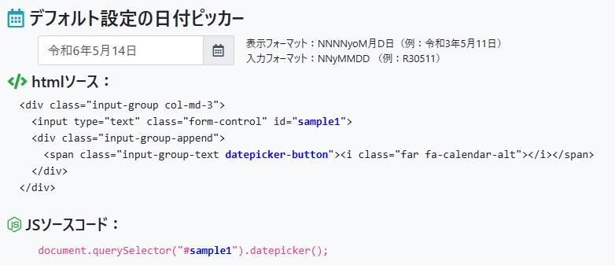
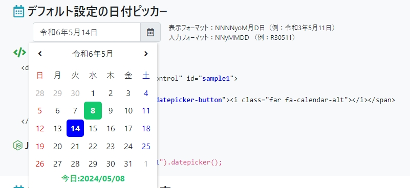
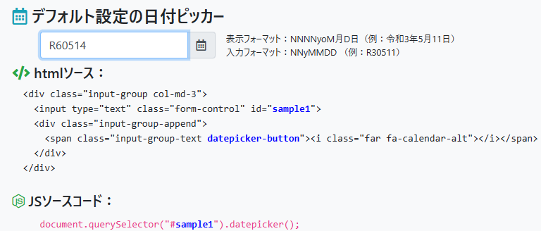

# 和暦-西暦変換日付ピッカー(bq-datepicker)

## 必要なパッケージ
### CSSファイル

- `<link href="/bootstrap/bootstrap.min.css" rel="stylesheet">`
- `<link href="/fontawesome/css/fontawesome.css" rel="stylesheet">`
- `<link href="/fontawesome/css/brands.css" rel="stylesheet">`
- `<link href="/fontawesome/css/solid.css" rel="stylesheet">`
- `<link href="/fontawesome/css/regular.css" rel="stylesheet">`
- `<link href="/bq-datepicker.css" rel="stylesheet">`

### JSファイル

- ``
- ``
- ``

## 例
- デフォルト画面

    
    
    **表示フォーマット**の形式で日付をフォーマットします
- 日付ピッカーを開く
  
    

- フォーカスイン
  
    

    
    **入力フォーマット**の形式で日付をフォーマットします

-----
## 詳細は[サンプル画面](https://bqweapons.github.io/bq-datepicker/)をご覧ください。